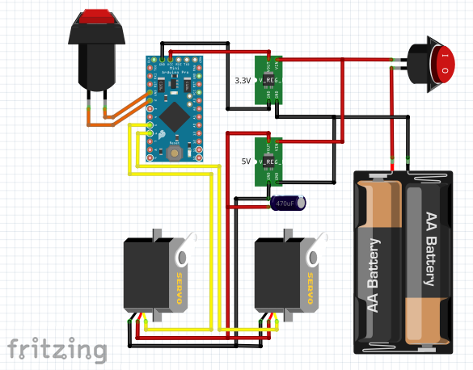
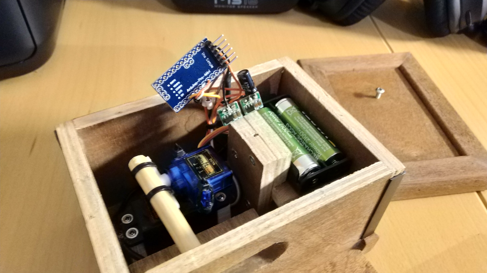
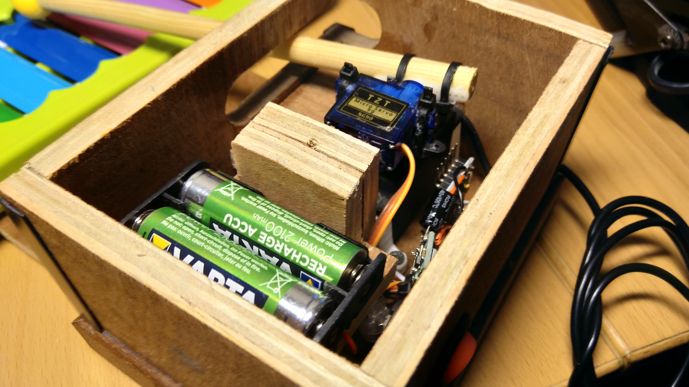

# Arduino Xylophone

Arduino based xylophone playing a random song when the button is pushed. The goal of this project was to create a simple and fun training toy for kids with mental or physical restrictions, for whom pushing a button can be quite a challenge. As always with my projects: if you have any additions (like songs), improvements or whatsoever let me know!

##### YouTube:

#### Requirements:
* 1x Arduino Pro Mini ATMega 328p 3.3V
* 1x 470µF Capacitor
* 1x 1V-5V to 3.3V DC-DC Step-Up Power booster
* 1x 1V-5V to 5V DC-DC Step-Up Power booster
* 1x Servo SG90 180 degrees (top)
* 1x Servo 4503HB 180 degrees (bottom) *(*1)*
* 1x Power Switch
* 1x Battery case - 2slot AAA
* Programming board for the Arduino Pro Mini *(*2)*
* Soldering equipment
* Toy Xylophone, capable of playing half notes
* External button (for activation)
* Case (wood, 3D printed, whatever's possible)
* Glue

**1:  For the bottom servo, the SG90 is not powerful enough to stop the moving stick instantly, resulting in wrong positions and making it bump around when trying to correct it's position. Therefore use a more powerful servo of your own choosing, like the 4503HB or simular.

**2: There are several solutions, like using another arduino with an USB interface like the R3 or Nano, or use an interface like the CP2102 wich I preferred (don't forget to also order your dupont cables)*

#### Electronics:

